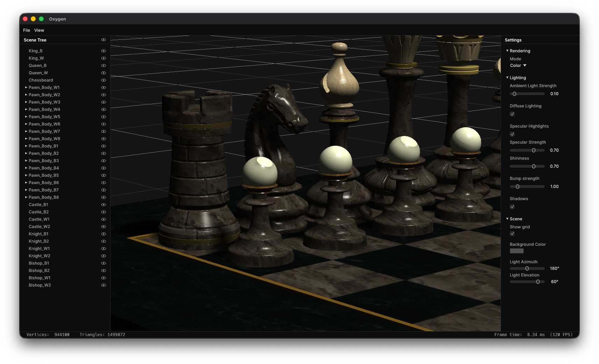
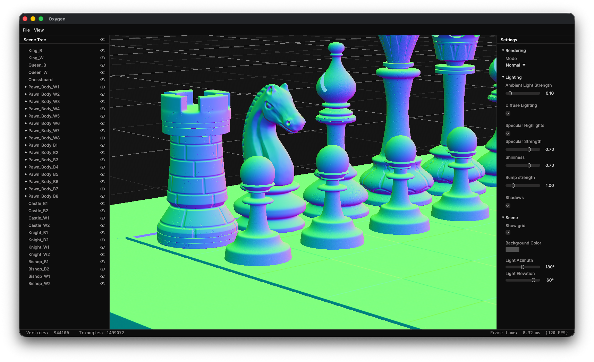
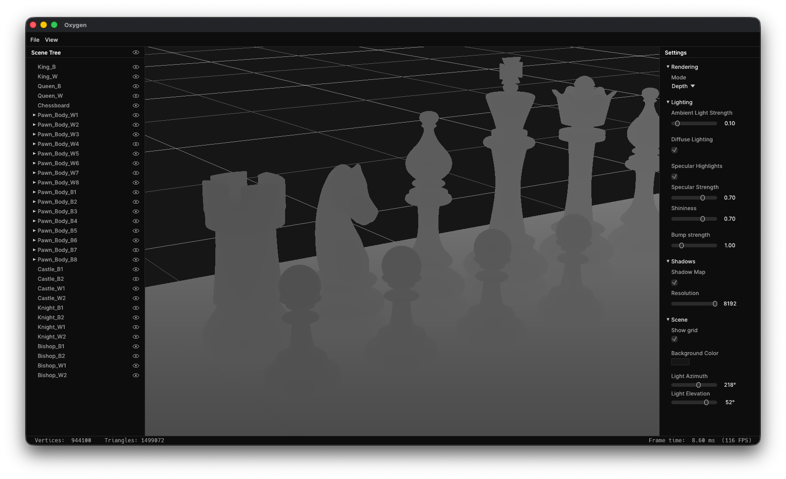
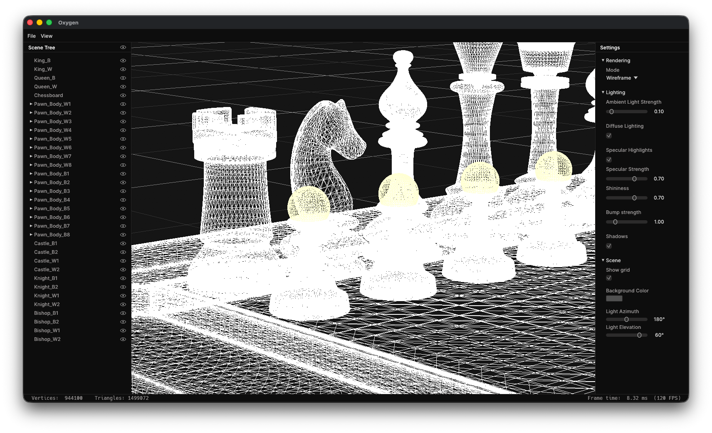

# Oxygen

A real-time [glTF](https://www.khronos.org/gltf/) viewer and renderer built from scratch in Rust on [wgpu](https://github.com/gfx-rs/wgpu). Oxygen presents the
renderer as a small game-engine editor: load a model, inspect its scene graph, fly through the
viewport, and tune its shading live.


## How it works

Oxygen imports a glTF scene into a node tree and expands its meshes into independently drawable
primitives. Each primitive owns its vertex and index buffers together with a model/normal-matrix
uniform and texture bindings. The renderer then records a shadow pass followed by the scene pass
into an offscreen texture displayed directly in egui.

- **glTF scene graphs and materials.** The loader preserves node hierarchy and accumulated
  transforms, reads position, normal, UV, and tangent attributes, and loads base-color and normal
  textures. Color textures are uploaded as sRGB. Normal and other data textures remain linear.
- **Blinn–Phong lighting.** The fragment shader combines adjustable ambient and diffuse terms
  with a view-dependent Blinn–Phong specular highlight. Light azimuth, elevation, strengths, and
  shininess are all live editor controls.
- **Tangent-space normal mapping.** Tangents include the handedness needed to reconstruct the
  bitangent, giving normal maps the correct orientation under transformed geometry. A per-material
  scale and a global bump-strength control adjust the effect.
- **Shadow mapping.** A depth-only pass renders the scene from a directional light into a 2048²
  `Depth32Float` shadow map. The main pass uses a comparison sampler to test light-space depth.
  slope and constant depth bias reduce self-shadowing artifacts.
- **GPU-native editor viewport.** The scene is rendered to an sRGB texture, registered with egui,
  and drawn in the editor without a CPU readback. The hierarchy also supports per-node visibility.

## Render modes

The renderer includes views useful for inspecting geometry and shading:

| Color | Normal |
| :-: | :-: |
|  |  |
| Depth | Wireframe |
|  |  |

## Getting started

Install the Rust toolchain, then run:

```sh
cargo run --release
```

Use **File → Load file…** to open a binary glTF (`.glb`) scene. Sample scenes are included in
[`assets/glTF/`](assets/glTF/).

## Controls

- **Right mouse drag:** look around the viewport
- **W / A / S / D:** move forward / left / backward / right
- **Q / E:** move up / down
- **Scroll or pinch:** adjust field of view
- **View → Reset Camera:** restore the camera projection after resizing

## Features

- Rust, `wgpu`, `winit`, `egui`, and WGSL shaders
- Binary glTF loading with node transforms, indexed meshes, base-color textures, and normal maps
- Per-primitive uniforms, depth testing, back-face culling, and an sRGB render target
- Directional-light shadow map and adjustable Blinn–Phong material controls
- Color, normal, depth, and hardware line-rasterized wireframe views
- Scene-tree visibility controls, grid overlay, background-color picker, frame time, and geometry statistics

## Credits

The bundled glTF scenes are from the [Khronos glTF Sample Assets](https://github.khronos.org/glTF-Assets/) project.
